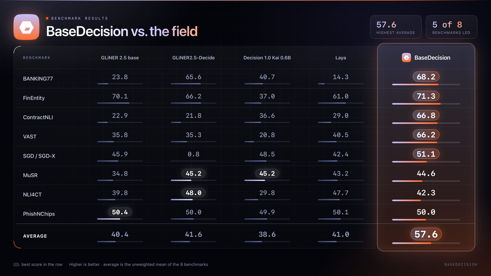

# BaseDecision

**Ask a question about a text. Get the answer and how sure the model is.**
Pick one option, answer yes/no, or give a rating, for texts up to 8,192 tokens. It runs on your
own laptop or GPU, with no API key, or through OpenAI/Anthropic. It is a classifier, not a chatbot:
it never writes text, it chooses among the answers you give it.

**Release candidate 0.1.0rc5.** Local inference matches RC2's 8,751-decision regression (identical
logits and labels). The OpenAI/Anthropic backends are tested against mock servers only; live
provider acceptance is pending.

## Install

```bash
pip install ".[runtime]"    # run this inside this folder; needs Python 3.10+
```

That is all for local use (the first-time download of Torch is large). Not on PyPI yet.

| I want to... | Install |
|---|---|
| Run the model on my machine (CPU or NVIDIA GPU; Apple-silicon Macs use the CPU) | `pip install ".[runtime]"` |
| ...and download the model from Hugging Face | `pip install ".[runtime,hub]"` |
| Use OpenAI or Anthropic only, no Torch | `pip install ".[providers]"` |

Already have Torch 2.6+ and Transformers 4.48-4.57 and want pip to leave them alone?
`pip install --no-deps .` installs only BaseDecision. Nothing is ever installed behind your back: a
missing package gives an error that says which extra to install.

## Try it

```python
from basedecision import load

model = load('/path/to/model')   # the folder with model.safetensors; GPU if you have one, else CPU
result = model.choose(context='Please refund my purchase.',
                      question='What does the customer request?',
                      options=['Refund', 'Delivery status', 'Change address'])
print(result.answer)          # Refund
print(result.probabilities)   # Refund is about 0.99999, the other two about 0.000002
```

Loading takes about 8 s and ~2 GiB of RAM; each answer takes about 0.05 s on a laptop CPU for short
texts. No flags are needed.

## How it performs

BaseDecision against GLiNER 2.5 base, Laya and two further baselines on eight benchmarks (higher is
better):



- **Highest average:** 57.6, against 38.6 to 41.6 for the other four models (the unweighted mean of
  the eight benchmarks).
- **Ahead on five benchmarks:** BANKING77, FinEntity, ContractNLI, VAST and SGD/SGD-X, by 1.2 to 30.2
  points. The largest gaps are on ContractNLI and VAST.
- **Behind on two:** MuSR (44.6 against 45.2) and NLI4CT (42.3 against 48.0).
- **PhishNChips does not separate the models:** all five score between 49.9 and 50.4.

Treat this as a guide, not a guarantee. How a decision model does depends on the task and the wording
of its questions, so try it on a sample of your own before relying on it. The probabilities it returns
are raw softmax values, not calibrated confidence (see [Calibration](docs/CALIBRATION.md)).

## Examples

These examples reuse the `model` from above.

### Yes or no: `check`

```python
result = model.check(context='The account is active.', question='Is the account active?')
print(result.answer)   # True (a real Python bool)
```

### A rating: `score`

```python
result = model.score(context='I am satisfied.', question='How satisfied is the customer?',
                     levels=['Dissatisfied', 'Neutral', 'Satisfied'], values=[1, 2, 3])
print(result.answer, round(result.expected_value, 2))   # Satisfied 3.0
```

### Several questions about one text: `decide`

```python
from basedecision import decide

answers = decide(model, context='I was charged twice. Please refund the duplicate payment.',
                 questions={
                     'intent': {'kind': 'choice', 'question': 'What does the customer request?',
                                'options': ['Refund request', 'Delivery status', 'Other']},
                     'duplicate': {'kind': 'noul', 'question': 'Was the customer charged twice?'},
                 })
print(answers['intent'].answer, answers['duplicate'].answer)   # Refund request True
```

`kind` is `choice`, `noul` (yes/no) or `score`. Each question is answered independently.

### Options with descriptions: `Option`

Plain strings are fine. If a label is ambiguous, add a description:

```python
from basedecision import Option

result = model.choose(context='Where is my parcel?', question='What is requested?',
                      options=[Option('refund', 'Customer wants money back'),
                               Option('status', 'Customer asks where the parcel is')])
print(result.answer, '-', result.label)   # status - Customer asks where the parcel is
```

### Many texts at once: `predict_batch`, `predict_iter`

```python
from basedecision import Request

options = (Option('refund', 'Refund'), Option('status', 'Delivery status'))
requests = [Request('Please refund this purchase.', 'What is requested?', options),
            Request('Where is my parcel?', 'What is requested?', options)]
print([r.answer for r in model.predict_batch(requests)])    # ['refund', 'status']
for result in model.predict_iter(requests):                 # same, one at a time, for long streams
    print(result.answer)
```

### Everything in a result

```python
print(model.choose(context='Please refund my purchase.', question='What is requested?',
                   options=['Refund', 'Other']).to_dict())
# answer, option_id, label, probabilities, raw_logits, packed_tokens, kind, ...  (plain JSON types)
```

`probabilities` are the model's raw softmax, not calibrated.

### Download the model from Hugging Face: `load_from_hub`

Needs `pip install ".[runtime,hub]"`. The repository name is a placeholder until the model is published.

```python
from basedecision import load_from_hub

model = load_from_hub('YOUR_NAMESPACE/YOUR_MODEL', revision='YOUR_COMMIT_HASH')
```

A commit hash pins the exact weights. Add `local_files_only=True` to use only the local cache. Sign-in
uses the standard Hugging Face setup; no remote Python code is ever run.

### Force the CPU or the GPU

```python
model = load('/path/to/model', device='cpu', precision='fp32')
print(model.device, model.precision)    # cpu fp32
# load('/path/to/model', device='cuda')   # force the GPU; an error if there is none
```

`load` picks CUDA with BF16 when a suitable NVIDIA GPU exists, else the CPU with FP32. An explicit
choice is never second-guessed. Rough CPU timings on one 10-core Apple-silicon laptop (a guide, not a
benchmark):

| Text length | Time per answer | Peak memory |
|---|---:|---:|
| short (a few dozen tokens) | ~0.05 s | ~2 GiB |
| 512 tokens | ~0.4 s | ~2 GiB |
| 4,096 tokens | ~8 s | ~5 GiB |
| 8,191 tokens (the limit) | ~30 s | ~8 GiB |

### Experimental CPU mode: `cpu_fast`

```python
from basedecision import load, CPUFastUnavailable

try:
    model = load('/path/to/model', backend='cpu_fast')
except CPUFastUnavailable:                  # unsupported Torch/Transformers: nothing is changed
    model = load('/path/to/model')          # the normal CPU path
```

Opt-in and experimental: it checks itself at load time and never falls back silently. It was
developed on an Intel Xeon server and was 10-15x *slower* than the default on an Apple-silicon laptop,
so measure before you use it. See [CPU support and limitations](docs/CPU.md).

### OpenAI or Anthropic instead of the local model

```bash
export OPENAI_API_KEY=...     # or ANTHROPIC_API_KEY; needs: pip install ".[providers]"
```

```python
from basedecision import BaseDecision

with BaseDecision.from_provider('openai', 'YOUR_OPENAI_MODEL_ID') as cloud:
    result = cloud.choose(context='Please refund this purchase.',
                          question='What does the customer request?',
                          options=['Refund request', 'Delivery status', 'Other request'])
    print(result.answer)   # same methods as the local model; swap in 'anthropic' for Anthropic
```

Your text is sent to that provider, and never as an automatic fallback. Cloud results have no
probabilities (`result.probabilities is None`). Reasoning models, errors, retries and costs:
[docs/CLOUD.md](docs/CLOUD.md).

### Calibrated probabilities (optional, GPU only)

Raw probabilities are the default. For the assessed SGD service-intent workloads only, you can opt in
to calibrated ones. This needs a CUDA GPU with BF16 and handles `choice` questions only.

```python
from basedecision import CalibratedDecision, calibration_profiles

print(list(calibration_profiles()))   # ['clinc', 'sgd_identifier', 'sgd_schema', 'vast']
calibrated = CalibratedDecision(model, profile='sgd_schema')   # raises on a CPU-only machine
result = calibrated.predict(sgd_request)    # a correctly formatted SGD request
print(result.probabilities, result.raw_probabilities)
```

These profiles do not apply to other questions. Coverage and caveats: [docs/CALIBRATION.md](docs/CALIBRATION.md).

### Answer Jev / SystemOne requests: `SystemOne`

For the Jev/SystemOne wire format (a `state` and typed `questions`):

```python
from basedecision import SystemOne

service = SystemOne(model)
response = service({'model': 'basedecision',
                    'state': 'Our checkout started returning errors and orders are blocked.',
                    'questions': {
                        'department': {'type': 'choice', 'instructions': 'Which team should handle it?',
                                       'criteria': {'billing': 'Payments or invoices',
                                                    'technical': 'Bugs or outages'}},
                        'outage': {'type': 'noul', 'instructions': 'Is a service down?'}}})
print(response['answers']['department']['choice'])   # technical
```

Or serve it over HTTP (a reference server, bound to localhost; see
[docs/SYSTEMONE.md](docs/SYSTEMONE.md) before exposing it):

```bash
python examples/systemone_server.py --model /path/to/model
curl -s localhost:8080/v1/systemone -H 'Content-Type: application/json' \
  -d '{"model":"basedecision","state":"I was charged twice. Please refund me.","questions":{"refund":{"type":"noul","instructions":"Does the customer want a refund?"}}}'
```

Text only, one forward pass per question, no truncation, and no cloud providers (they return no
probabilities).

### Free the memory when you are done: `close`

```python
with load('/path/to/model') as scratch:     # the weights are freed when the block ends
    print(scratch.check(context='The account is active.', question='Is the account active?').answer)   # True
print(scratch.closed)   # True: asking a closed model for an answer raises InputError
```

`model.close()` does the same without a `with` block, and is safe to call twice. It waits for a request
that is running, then frees the weights and, on a GPU, the memory they held. The cloud backend and
`cpu_fast` models work the same way.

## Limits and errors

```python
from basedecision import ContextLengthError, InputError

print(model.count_tokens(requests[0]))   # 22: how many tokens a request uses, before you run it
try:
    model.choose(context='word ' * 20000, question='Which?', options=['a', 'b'])
except ContextLengthError as error:
    print(error.required_tokens, error.maximum_tokens)   # 20014 8192
except InputError as error:                              # bad options, wrong types, duplicates
    print(error)
```

- The limit is **8,192 tokens in total**: the question, every option and the text. Nothing is ever
  silently truncated; an over-long input is a `ContextLengthError` you can handle, for example by
  splitting the text.
- `InputError` means the request itself is wrong. The context must be a string (serialize structured
  data yourself), and option ids and labels must be distinct.
- A cloud call that fails raises `ProviderError` with `code`, `retryable` and `status_code`, and never
  includes your key or text ([docs/CLOUD.md](docs/CLOUD.md)).
- A refused or invalid answer is an error, never a guessed label or a silent `False`.

## More

- [Python API reference](docs/API.md) · [Calibration](docs/CALIBRATION.md) · [CPU mode](docs/CPU.md) ·
  [Cloud backends](docs/CLOUD.md) · [Jev / SystemOne](docs/SYSTEMONE.md)
- [Model card](MODEL_CARD.md) (quality and limitations) · [Benchmarks](BENCHMARKS.md) ·
  [Security](SECURITY.md) · [Changelog](CHANGELOG.md) · [Contributing](CONTRIBUTING.md)
- Runnable scripts: `examples/python_quickstart.py`, `examples/decide.py`,
  `examples/systemone_quickstart.py`, `examples/systemone_server.py`.

```bash
python -m unittest discover -s tests -v                                          # no model needed
BASEDECISION_TEST_MODEL=/path/to/model python -m unittest discover -s tests -v   # + the real model
```

With a checkpoint, the tests run the examples above in order and check the output they print. The
Hugging Face, cloud and GPU-calibration examples cannot run on a laptop, so they are only checked
for syntax and imports.

BaseDecision is a decision model (ModernBERT-large encoder with a typed decision head, 8,192-token
window). It has no `.generate()`, no `AutoModelForCausalLM`, no chat endpoint, and no reasoning
comparable to a general chat model.

---

## License

Apache 2.0. Developed by Hrudayaditya "Aady" Jallu.
